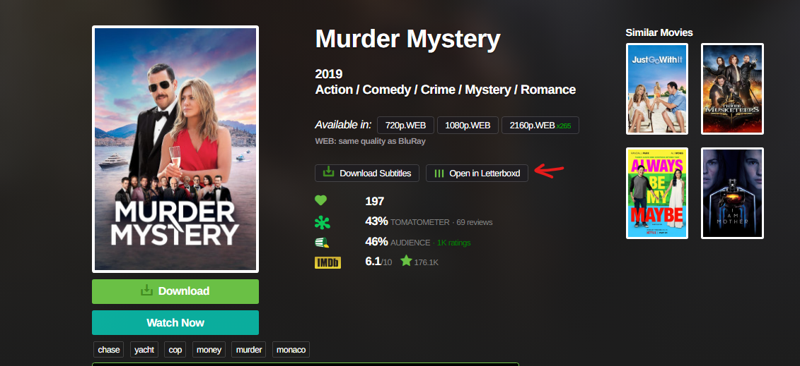
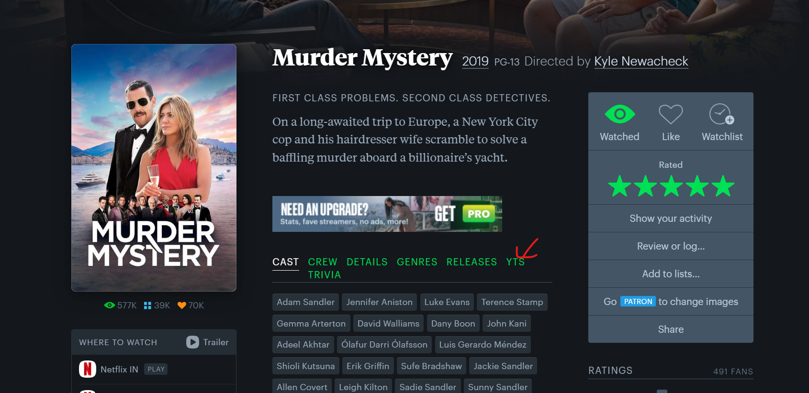

# YTS-Letterboxd Bridge

A browser extension that enhances your movie browsing experience by adding a direct link to Letterboxd from YTS movie pages and vice versa.

## Features

- Adds a "Open in Letterboxd" button to YTS movie pages
- Adds a "YTS" button to Letterboxd movie pages
- Smart URL handling:
- Zero configuration needed

## Installation

1. Clone this repository or Download and unzip the repository.
2. Open Chrome and navigate to `chrome://extensions/`
3. Enable "Developer mode" in the top right
4. Click "Load unpacked" and select the extension directory

## Usage

Visit any movie page on YTS (e.g., https://yts.mx/movies/...)
1. Look for the green "Open in Letterboxd" button next to the subtitle download button
2. Click to open the movie in Letterboxd in a new tab

Also Visit any movie page on Letterboxd (e.g., https://letterboxd.com/film/...)
1. Look for the green "YTS" next to Releases
2. Click to open the movie in YTS in a new tab

## Screenshots

### YTS Integration

*Letterboxd button seamlessly integrated into YTS movie page*

### Letterboxd Integration

*YTS button added to Letterboxd movie page*

## Contributing

Pull requests are welcome. For major changes, please open an issue first to discuss what you would like to change.

## License

[MIT](https://choosealicense.com/licenses/mit/) 
